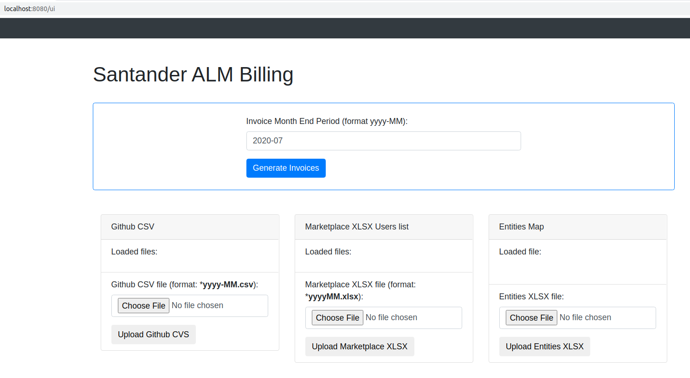
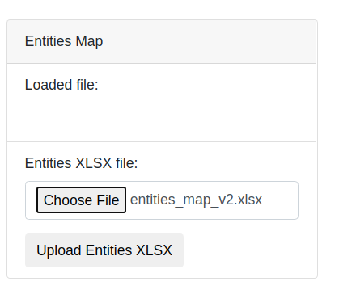
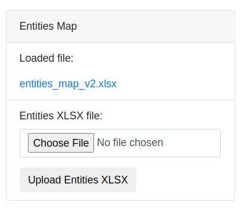
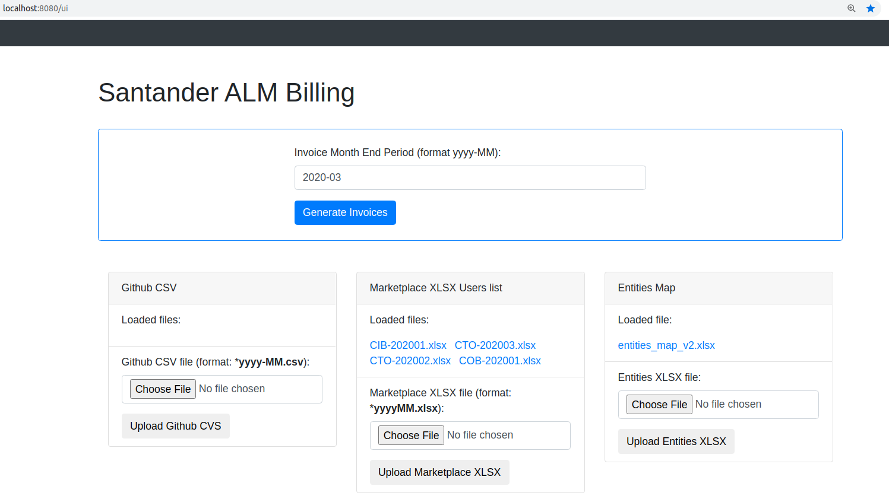
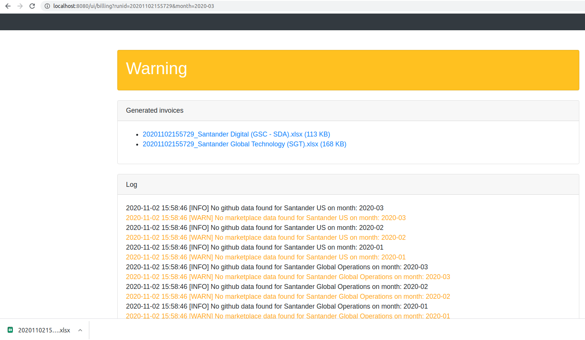
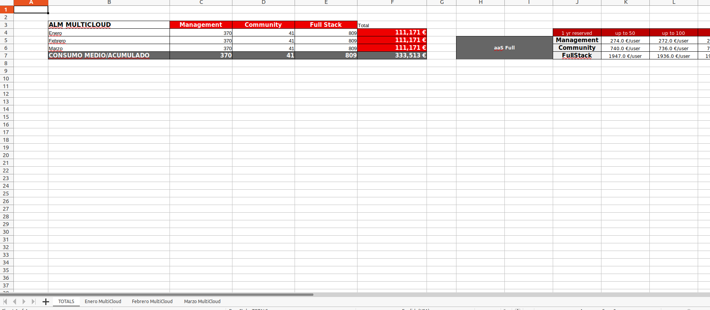

# alm-automation-billing

Automation project for ALM billing and accounting processes.

Docker image build is integrated into github actions (see __.github/workflows/maven.yml__):

> docker build -t $REPO:latest -t $REPO:${GITHUB_SHA::8} .

Each change in master branch starts new build and, if build has done successfully, new docker image snapshot is deployed to github packages of this github repository.

## Run docker image

> docker run -d --name santander-billing -p 8080:8080 -e STORAGE_FOLDER=/tmp/alm-billing docker.santander.com:5000/santander/alm-automation-billing

## Build Java Application With Maven

> mvn clean package -Ddocker.skip=false -Ddocker.santander.com:5000/ -Ddocker.username=USRNAME -Ddocker.password=SECRET

## Run standalone spring boot application :

> java -jar target/alm-automation-billing-0.1-SNAPSHOT.jar -DSTORAGE_FOLDER=/tmp/alm-billing 

## How to run in localhost and test application

1- [Run docker image](#run-docker-image).

2- Navigate to ui: [http://localhost:8080/ui](http://localhost:8080/ui) and authenticate with demo example: billing / secret:

4- Load entities map. Plase, download sample [here](src/test/resources/storage/entities/entities_map_v2.xlsx). This operation only be necessary first time because this files will be stored into STORAGE_FOLDER.

5- Load marketplace excels data (only first time because this files will be stored into STORAGE_FOLDER):

6- Generate invoices for all entities of all previous months of same year used as parameter. For example, if is used 2020-03, invoices will be of January to March of 2020. 
Is  __IMPORTANT__  to remark that invoices data will be calculated from marketplace excels and github csv's loaded that contains data of its months. So, if no github csv data is loaded, no github data will shown on any generated invoice.

6- Click on entity invoice to see or download.

	
	

## Urls

Service urls are shown from swagger utility:

. [http://localhost:8080/ui](http://localhost:8080/ui)

. [http://localhost:8080/swagger-ui.html](http://localhost:8080/swagger-ui.html)

#### Properties configuration

> src/main/resources/application.properties

Disponible options:

| Param                        | Description                                   | Default value                                            |
| -------------------------------- | -------------------------------------------- | ------------------------------------------------------------ |
| billing.files.folder      | Work storage folder of application (will be stored github csv's, marketplace excels, and entities map excel). | ``/tmp/alm-billing`` |
 

## UML

 
 

## References

. [https://docs.github.com/en/rest/reference/billing](https://docs.github.com/en/rest/reference/billing) 

. [https://www.elastic.co/guide/en/elasticsearch/reference/current/rest-apis.html](https://www.elastic.co/guide/en/elasticsearch/reference/current/rest-apis.html)

. [Enterprise Account Billing Proposal Model](https://github.com/ALM-Multicloud-Assets/wiki-docs/wiki/Billing-model-proposals) 

